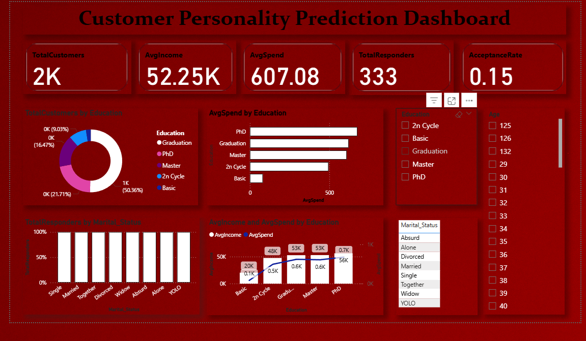

# Customer Personality Prediction

##  Project Objective
This project aims to analyze customer demographics and behavior, segment customers using clustering, and predict their likelihood of responding to marketing campaigns using classification models. The project concludes with an interactive Power BI dashboard for insights and business decision support.

---

## Dataset Info
- Source: [Marketing Campaign Dataset](https://github.com/entbappy/Branching-tutorial/blob/master/marketing_campaign.csv)
- Records: 2,240 customers
- Fields: Demographics, purchase behavior, campaign responses

---

## 🔍 EDA Insights
- Most customers are aged between 30-50
- Higher spending is associated with younger customers
- Education level and marital status show trends in responsiveness

---

## Preprocessing
- Handled missing values in `Income`
- Engineered `Age` and `Total_Spending`
- Encoded categorical variables with one-hot encoding
- Scaled data for clustering

---

## Machine Learning
### Clustering (KMeans)
- Used Age, Income, and Spending for segmentation
- Found 4 distinct customer segments

### Classification (Random Forest)
- Target: `Response` (Marketing Campaign Response)
- Accuracy: XX% (fill after testing)
- Evaluated with precision, recall, f1-score

---

## Power BI Dashboard
Interactive dashboard built with:
- Customer segments by demographics
- Campaign response prediction
- Top features influencing response

Screenshots:

---

## Project Structure

├── data/
│ └── marketing_campaign.csv
├── exports/
│ ├── df_with_segments.csv
│ ├── df_model_predictions.csv
│ └── feature_importance.csv
├── notebooks/
│ └── customer_personality_analysis.ipynb
├── visuals/
│ └── powerbi_dashboard.png
├── README.md
└── requirements.txt

---

## Tools Used
- Python (Pandas, Seaborn, Scikit-learn)
- Jupyter Notebook
- Power BI
- GitHub

---

## Key Takeaways
- Segmenting customers reveals targeted marketing potential
- Income and Age are top features for predicting response
- Visual dashboards enhance decision-making for business teams

---

